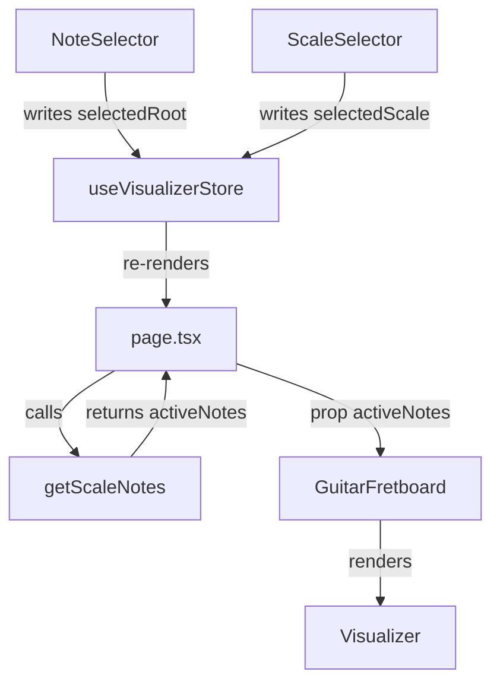

```mermaid
flowchart TD
    A[NoteSelector]
    B[ScaleSelector]
    C[useVisualizerStore]
    D[page.tsx]
    E[getScaleNotes]
    F[GuitarFretboard]
    G[Visualizer]
    A -->|writes selectedRoot| C
    B -->|writes selectedScale| C
    C -->|re-renders| D
    D -->|calls| E
    E -->|returns activeNotes| D
    D -->|prop activeNotes| F
    F -->|renders| G
```